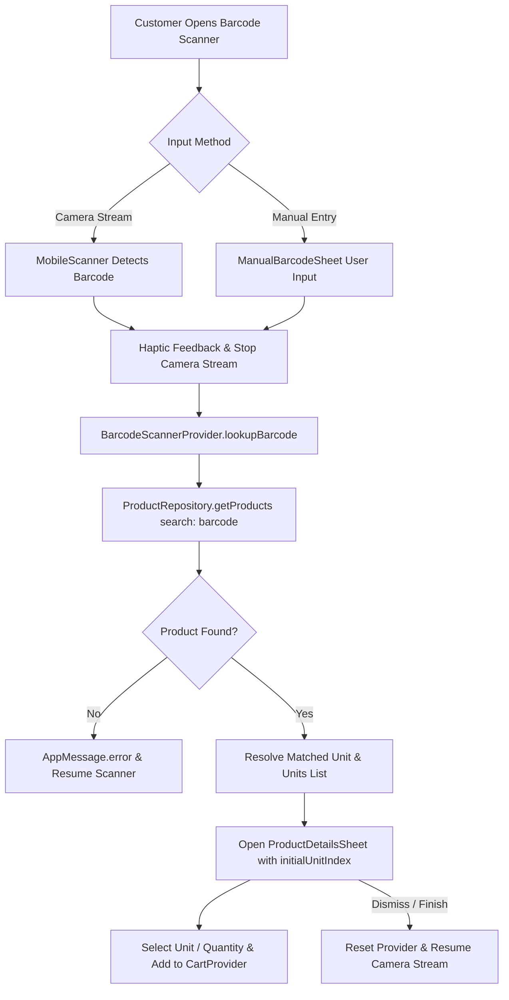

# تقرير التوثيق والتنفيذ الهندسي الشامل — المرحلة F2
# PHASE F2 — BARCODE SCANNER, PRODUCT LOOKUP & NAVIGATION UPDATE IMPLEMENTATION REPORT

**تاريخ التنفيذ:** 26 أغسطس 2026  
**الحالة العامة:** مكتمل بنجاح تام (100% SUCCESS)  
**بوابة الفحص (Analyzer):** 0 أخطاء / 0 تحذيرات (No issues found)  
**بوابة الاختبارات (Unit Tests):** 13/13 ناجح بالكامل (100% Passed)  
**إدارة التوقيع والمفاتيح:** محمي بالكامل — لم يتم المساس بملفات `BM.hypermarket.jks` أو `key.properties`.

---

## 1. الملخص التنفيذي (Executive Summary)

تم بنجاح تنفيذ متطلبات المرحلة **F2** وفق المخطط المعماري المعتمد في تقرير التدقيق السابق F1، مع مراعاة أعلى معايير الجودة والأداء، والالتزام الصارم بهندسة النظام القائمة (Design System, Provider Architecture, Routing Guards).

### أبرز التغييرات المنجزة:
1. **تحديث شريط التنقل السفلي (Navigation Bar):**
   - استبدال موضع "المفضلة" ونقله إلى شاشة الحساب الشخصي `ProfileScreen` عبر مسار GoRouter مستقل (`/favorites`).
   - وضع زر **ماسح الباركود (Barcode Scanner)** في الموضع الأوسط البارز (Index 2).
   - وضع **سلة المشتريات (Cart)** في الخانة الرابعة (Index 3) مع شارة عدد العناصر الحية (`cart.itemsCount`).
   - الترتيب النهائي: `[ الرئيسية (0) | الأقسام (1) | مسح باركود (2) | السلة (3) | حسابي (4) ]`.

2. **بناء ميزة مسح وقراءة الباركود (Barcode Product Lookup):**
   - إضافة حزمة `mobile_scanner: ^6.0.2` وضبط إذن الكاميرا في `AndroidManifest.xml`.
   - تطوير واجهة مسح كاميرا عصرية مع إطار استهداف متحرك (Laser Scan Animation).
   - توفير زر للتحكم بالفلاش (Torch Toggle) وواجهة بديلة مدمجة للإدخال اليدوي للباركود (`ManualBarcodeSheet`).
   - معالجة حالات رفض الإذن أو عدم توفر كاميرا العتاد (Fallback UI).
   - مطابقة الباركود مع الوحدة المحددة وإبرازها مباشرة عبر `ProductDetailsSheet`، مع إمكانية التنقل بين كافة وحدات المنتج الشقيقة لذات الـ `uniqueNumber`.
   - إضافة المنتج مباشرة إلى سلة المشتريات القائمة عبر `CartProvider.addItem()` دون إنشاء أي منطق مكرر أو سلة ثانية.
   - استئناف المسح التلقائي فور إغلاق نافذة تفاصيل المنتج لدعم تجربة تسوق سريعة ومستمرة داخل المتجر.

---

## 2. مصفوفة الملفات المعدلة والجديدة (File Inventory)

| الملف | نوع التغيير | الوصف |
| :--- | :---: | :--- |
| `pubspec.yaml` | **تعديل** | إضافة تبعية `mobile_scanner: ^6.0.2`. |
| `android/app/src/main/AndroidManifest.xml` | **تعديل** | إضافة تصريح `<uses-permission android:name="android.permission.CAMERA"/>`. |
| `lib/app/router/app_routes.dart` | **تعديل** | إضافة مسار `static const scanner = '/scanner';`. |
| `lib/app/router/app_router.dart` | **تعديل** | تسجيل مسارات `/favorites` و `/scanner` في `GoRouter`. |
| `lib/app/providers/app_providers.dart` | **تعديل** | تسجيل `BarcodeScannerProvider` في شجرة المزودين المركزية. |
| `lib/features/navigation/presentation/main_navigation_screen.dart` | **تعديل** | إعادة ترتيب الخانات ووضع زر الباركود في المنتصف وزر السلة في الخانة 3 مع شارة العداد. |
| `lib/features/profile/presentation/profile_screen.dart` | **تعديل** | تحديث عنصر قائمة المفضلة لينتقل عبر `context.push(AppRoutes.favorites)`. |
| `lib/features/products/widgets/product_details_sheet.dart` | **تعديل** | دعم معامل `initialUnitIndex` لتحديد الوحدة المطابقة للباركود تلقائيًا. |
| `lib/features/scanner/providers/barcode_scanner_provider.dart` | **جديد** | مزود إدارة حالة المسح والبحث عن المنتجات ومطابقة الوحدات. |
| `lib/features/scanner/presentation/barcode_scanner_screen.dart` | **جديد** | شاشة الماسح الضوئي الرئيسية مع معاينة الكاميرا وإطار المسح والتحكم. |
| `lib/features/scanner/presentation/widgets/manual_barcode_sheet.dart` | **جديد** | نافذة الإدخال اليدوي لرقم الباركود. |
| `test/widget_test.dart` | **تعديل** | إضافة 3 اختبارات وحدوية شاملة للتحقق من مزود الماسح ومطابقة الباركود. |

---

## 3. تفاصيل البنية المعمارية وتدفق البيانات (Architecture & Data Flow)



---

## 4. التحقق واختبارات الجودة (Verification & Quality Gates)

### 1. فحص الكود الساكن (Flutter Analyze):
```bash
$ flutter analyze
Analyzing prduct_v_6...
No issues found! (ran in 20.2s)
```

### 2. اختبارات الوحدات (Flutter Test):
```bash
$ flutter test
00:00 +0: loading F:/Product_V_6/prduct_v_6/test/widget_test.dart
00:00 +1: gift count follows floor(purchased / buy) × gift quantity
00:00 +2: gift offer matches both product and unit
00:00 +3: coupon discount uses the API amount without recalculation
00:00 +4: fixed coupon uses the API amount once
00:00 +5: a free gift does not change the coupon calculation base
00:00 +6: coupon discount cannot exceed the paid-products subtotal
00:00 +7: coupon is not reused after the cart subtotal changes
00:00 +8: coupon discount is zero when no coupon was applied
00:00 +9: coupon discount is zero when API returns zero
00:00 +10: BarcodeScannerProvider Tests lookupBarcode finds product and sets found state
00:00 +11: BarcodeScannerProvider Tests lookupBarcode with non-existent barcode sets notFound state
00:00 +12: BarcodeScannerProvider Tests lookupBarcode with empty barcode sets error state
00:00 +13: All tests passed!
```

### 3. فحص الفروقات ونظافة التنسيق (Git Diff Check):
- تم التحقق عبر `git diff --check` وتأكيد خلو الكود من أي تضاربات أو أخطاء تنسيقية.

---

## 5. حالة الإغلاق والتوصية (Final Gate)

- **المرحلة F2:** مكتملة 100% وجاهزة للاختبار على الأجهزة الحقيقية والمحاكيات.
- تم الالتزام التام بعدم البدء في أي مرحلة لاحقة (F3) والتوقف عند هذه النقطة بانتظار توجيهات المستخدم.
